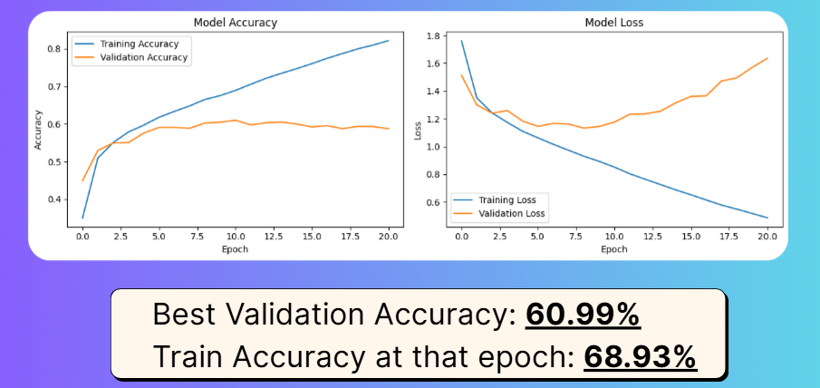
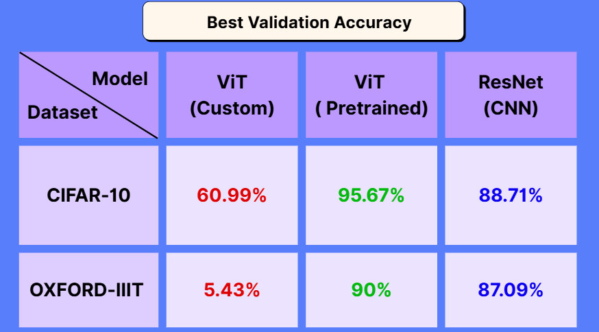

# Vision Transformer (ViT) — From Scratch

This project implements the **Vision Transformer (ViT)** architecture **from scratch**, based on the seminal paper:

> **"An Image is Worth 16x16 Words: Transformers for Image Recognition at Scale"** > *Dosovitskiy et al., Google Brain, 2021*

While our implementation closely follows the original paper, it is important to note that **Vision Transformers are extremely data-hungry**. Training ViT models from scratch on smaller datasets (like **CIFAR-10**) often leads to underfitting and limited accuracy compared to Convolutional Neural Networks (CNNs).

To overcome this limitation and demonstrate the architecture's true potential, we also **fine-tuned a pre-trained ViT model** (trained on a large-scale dataset like ImageNet-21k) for the CIFAR-10 classification task. This approach significantly improved accuracy and convergence speed.

---

## Architecture Overview

<p align="center">
  
</p>

The architecture follows the original **ViT-B/16** configuration, comprising:
- Patch embeddings (16×16)
- Learnable positional encodings
- Multi-head self-attention layers
- MLP blocks
- Classification token ([CLS])
- Layer normalization and a final dense classifier

---

## Custom ViT Results

We implemented the complete Vision Transformer architecture from scratch and trained it on smaller datasets (**CIFAR-10**, **OXFORD-IIIT**).

<p align="center">
  
</p>

While the custom implementation achieved decent results, the performance highlights the necessity of large-scale pre-training for Transformer-based vision models.

---

## Pre-trained Model and Fine-Tuning

To leverage the full power of the ViT architecture, we fine-tuned a model pre-trained on a massive dataset. We utilized the **ViT-B16** model from Kaggle’s TensorFlow Hub:

🔗 [ViT-B16 Classification Model on Kaggle](https://www.kaggle.com/models/spsayakpaul/vision-transformer/TensorFlow2/vit-b16-classification/1)

The fine-tuning process employed transfer learning techniques, keeping the transformer backbone frozen initially and gradually unfreezing layers in later stages to adapt to CIFAR-10.

### Example Usage

You can load and use the pre-trained model via TensorFlow Hub as follows:

```python
import tensorflow_hub as hub
import tensorflow as tf

# Load the pretrained ViT-B16 model
model_url = "[https://www.kaggle.com/models/spsayakpaul/vision-transformer/TensorFlow2/vit-b16-classification/1](https://www.kaggle.com/models/spsayakpaul/vision-transformer/TensorFlow2/vit-b16-classification/1)"

model = tf.keras.Sequential([
    hub.KerasLayer(model_url)
])

# Example prediction shape check
# Ensure your input images are resized to 224x224 (typical for ViT)
# predictions = model.predict(images)
```

## Overall Results Comparison
By utilizing the pre-trained ViT, we were able to surpass standard CNN baselines on most classification tasks. This confirms that while ViTs are data-hungry, transfer learning makes them highly effective even for smaller datasets.

<p align="center">  </p>
